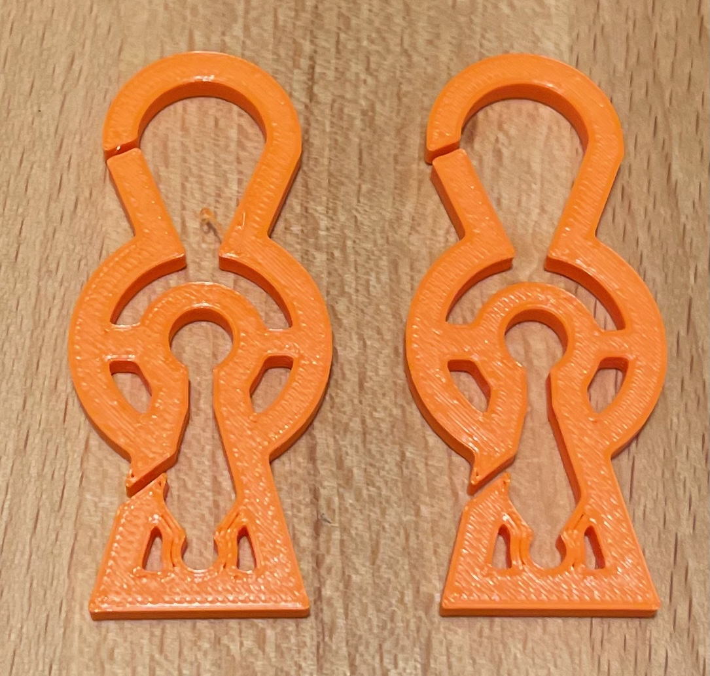
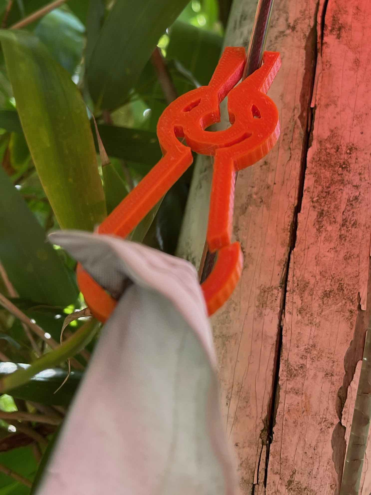

# flag-clip

Hybrid clip / carabiner 3D printable model to attach flags to the rope of a flag pole.

The gate of the carabiner does double duty as the lever of the clip.

Spring mechanism inspired by [https://www.thingiverse.com/thing:1212828/remixes](https://www.thingiverse.com/thing:1212828/remixes)

Since this was intended for outdoors use, I've printed this in PETG.

## Revision History

### 2022-05-15 Version 1.0	

Initial Design

### 2022-07-04 Version 2.0

Substantial Revision. It turns out that even a moderate wind was enough to pull the flag off the pole with the initial design. This revision is considerably more robust to wind, though it still failed in a heavy thunderstorm.
